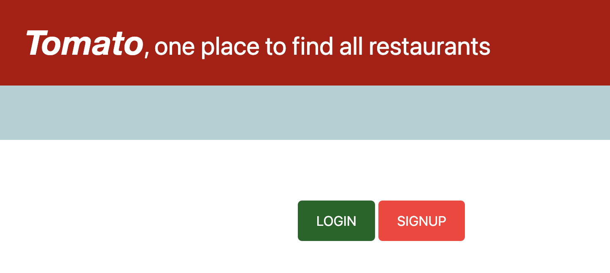
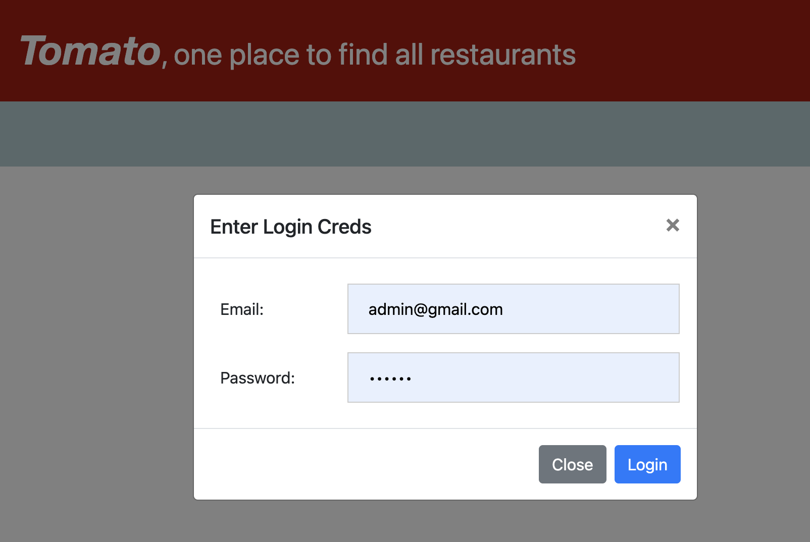
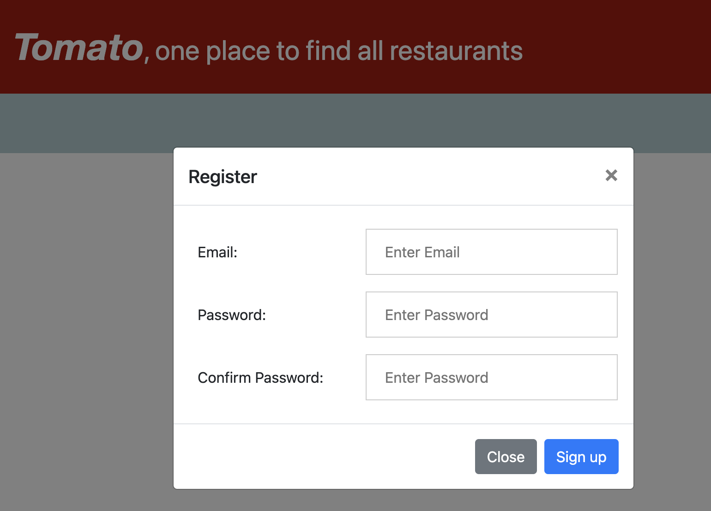
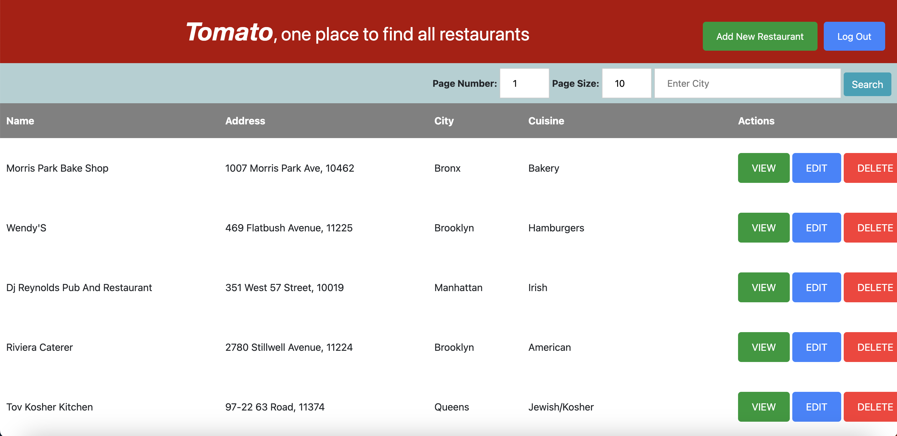
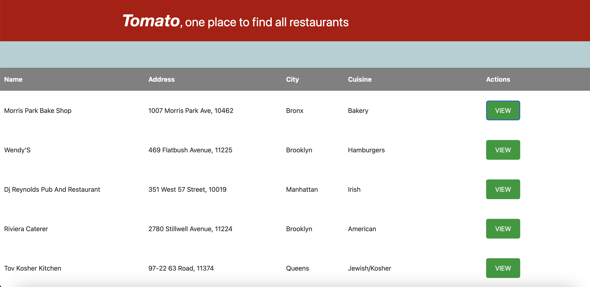
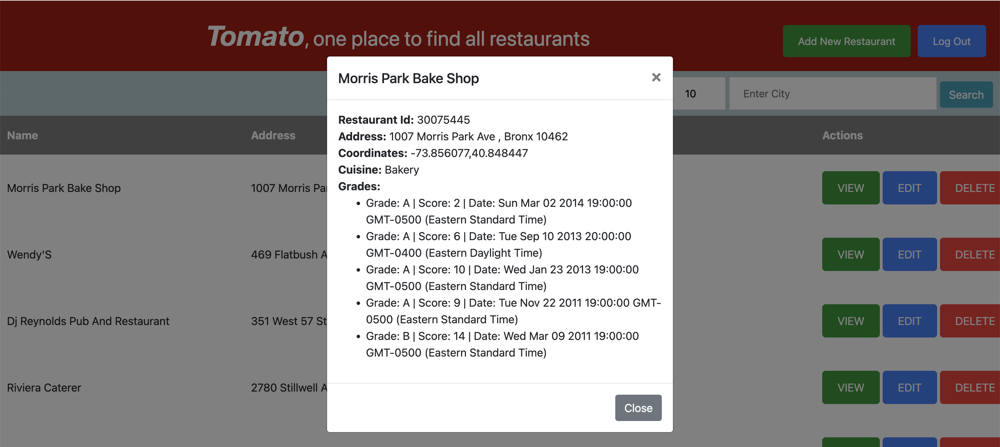
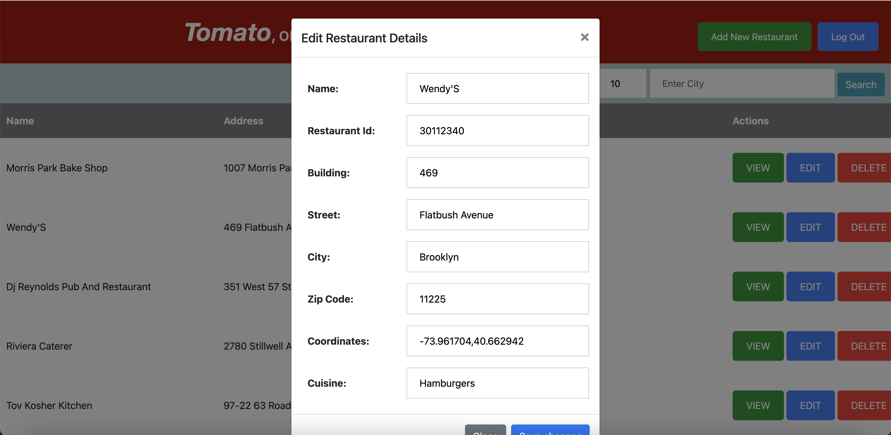
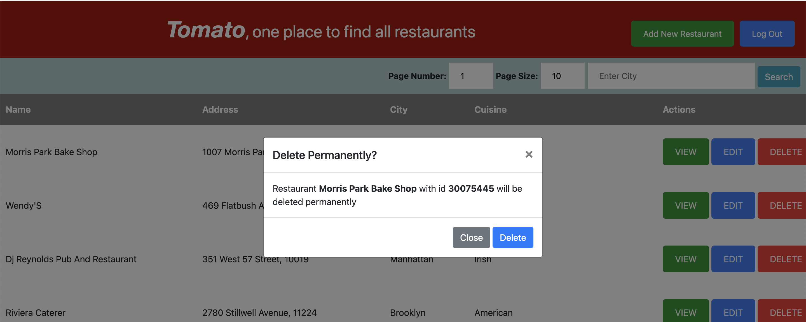
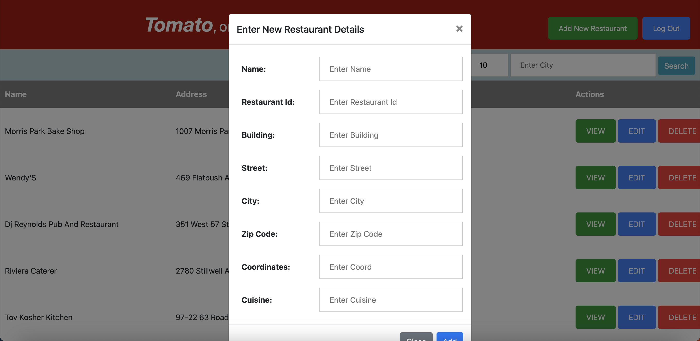

# MongoDB sample_restaurant  
Node application for sample_restaurants database provided by MongoDB. 

#### References
* [Modal Bootstrap](https://getbootstrap.com/docs/4.3/components/modal/)

## Available Scripts

In the project directory, you can run:

### `npm start`

Runs the app in the development mode.\
Open [http://localhost:8000](http://localhost:3000) to view it in the browser.

Replace With Mongo Connection string in dot env file
as per .env.example file.

## Look and Feel of the App

#### Landing Page

#### Login Page 

#### Signup Page

#### Home Page after Login

#### Home Page without login

#### View Restaurant Details

#### Update Restaurant

#### Delete Restaurant

#### Add a new Restaurant

